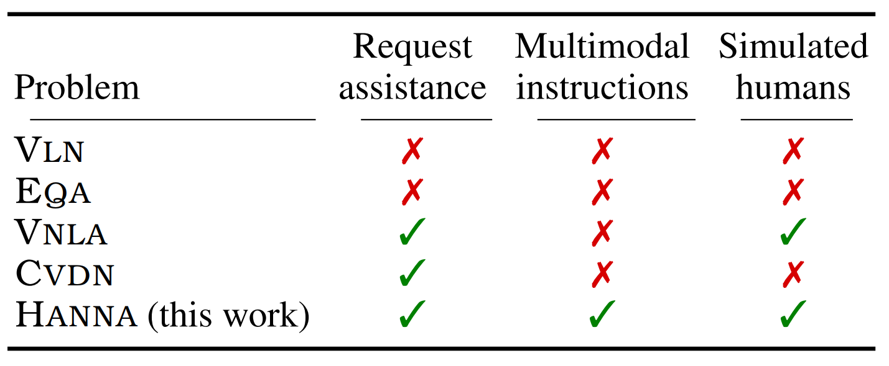

# HANNA: Visual Navigation with Natural Multimodal Assistance

[](https://opensource.org/licenses/MIT)  

Authors: [Khanh Nguyen](https://khanhptnk.github.io), [Hal Daumé III](http://users.umiacs.umd.edu/~hal/)

This repo contains code and data-downloading scripts for the paper [Help, Anna! Visual Navigation with Natural Multimodal Assistance via Retrospective Curiosity-Encouraging Imitation Learning](https://arxiv.org/abs/1909.01871) (EMNLP 2019). We develop *Help, Anna!* (HANNA), an interactive photo-realistic simulator in which an agent fulfills object-finding tasks by requesting and interpreting natural language-and-vision assistance.

### How is HANNA different from other photo-realistic visual navigation tasks?

<p align="center">

 <figcaption>Comparison HANNA with VLN <a href="https://arxiv.org/abs/1711.07280">(Anderson et al., 2018b)</a>, EQA <a href="https://arxiv.org/abs/1904.03461">(Wijmans et al., 2019)</a>, VNLA <a href="https://arxiv.org/abs/1812.04155">(Nguyen et al., 2019)</a>, CVDN <a href="https://arxiv.org/abs/1907.04957">(Thomason et al., 2019)</a>.</figcaption>
</p>

### System requirements

The environment simulator is installed and runs on a Docker image. Please install:

* [docker](https://docs.docker.com/install/)
* [nvidia-docker 2.0](https://github.com/nvidia/nvidia-docker/wiki/Installation-(version-2.0))

You can also install the simulator [without source code](https://github.com/peteanderson80/Matterport3DSimulator#building-without-docker) but it is not recommended!

### Let's get started!

0. `git clone --recursive https://github.com/khanhptnk/hanna-private.git` (don't forget the `recursive` flag!)
1. [Download data](https://github.com/khanhptnk/hanna-private/tree/master/data). 
2. [Setup simulator](https://github.com/khanhptnk/hanna-private/tree/master/code). 
3. [Run experiments](https://github.com/khanhptnk/hanna-private/tree/master/code/tasks/HANNA). 


### Citation

If you use the code or data in this repo, please cite our paper using the following bibtex code

```
@inproceedings{nguyen2019hanna,
  author = {Nguyen, Khanh and Daum{\'e} III, Hal},
  title = {Help, Anna! Visual Navigation with Natural Multimodal Assistance via Retrospective Curiosity-Encouraging Imitation Learning},
  booktitle = {Proceedings of the Conference on Empirical Methods in Natural Language Processing (EMNLP)},
  month = {November},
  year = {2019},
}
```
