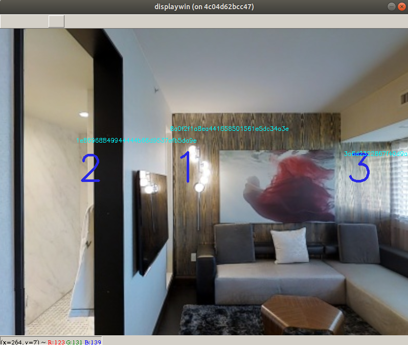

Please first [download the data](https://github.com/khanhptnk/hanna-private/tree/master/data)

HANNA extends the [Matterport3D simulator](https://github.com/peteanderson80/Matterport3DSimulator). It is easiest to setup on our pre-configured Docker image. If you want to setup with Docker, please make sure the following tools have been installed:
* [docker](https://docs.docker.com/install/)
* [nvidia-docker 2.0](https://github.com/nvidia/nvidia-docker/wiki/Installation-(version-2.0))

You can also install HANNA without Docker (similar to [installing the Matterport3D simulator without Docker](https://github.com/peteanderson80/Matterport3DSimulator#building-without-docker)) but it would be complicated to resolve the dependency requirements!

### 1. Build Docker image
```
$ sudo bash scripts/build_docker.sh
```

### 2. Run Docker image

Export link to the Matterport3D root directory

```
$ export MATTERPORT_DATA_DIR=<some_path>/v1/scans
```

Run the image without graphics
```
$ sudo -E bash scripts/run_docker.sh
```

### 3. Build the simulator

Inside the Docker image, run
```
~/mount/hanna/code# bash scripts/setup.sh
```

### 4. Test the simulator

```
~/mount/hanna/code# python scripts/test_api.py
```

Please make sure that the code runs without errors. 

### 5. Run the graphical driver

The graphical driver is useful for debugging and visualization. Follow the instructions of the [Matterport3D simulator](https://github.com/peteanderson80/Matterport3DSimulator) and make sure you are able to [run the driver](https://github.com/peteanderson80/Matterport3DSimulator#interactive-demo) on its repo. 

**NOTE**: if you encounter error messages like this
```
X Error: BadShmSeg (invalid shared segment parameter) 128
  Extension:    130 (MIT-SHM)
  Minor opcode: 2 (X_ShmDetach)
  Resource id:  0x3a0001d
```

Export `QT_X11_NO_MITSHM=1` may solve the problem
```
~/mount/Matterport3DSimulator# export QT_X11_NO_MITSHM=1
~/mount/Matterport3DSimulator# python src/driver/driver.py
```

After you successfully run the driver on the `Matterport3DSimulator` repo, run the driver on this repo as follows
```
$ sudo -E bash scripts/run_docker_graphics.sh
~/mount/hanna/code# python src/driver/driver.py
```

If everything is good, you will see the a window popping up like this

<p align="center">

</p>
